<h1>Hi There, I'm Tarun </h1>

> **Focused builds around security testing, OCR workflows, HTTP proxy tooling, and API documentation.**

## About Me

This profile is for smaller, focused projects and practical experiments.

Most of the work here sits around **security tooling**, **JavaScript utilities**, **documentation-first APIs**, and **web automation support systems**.

  
  
  
  
  

## Focus Areas

  
  
  
  

## GitHub Stats :chart_with_upwards_trend:

  <picture>
    <source media="(prefers-color-scheme: dark)" srcset="./profile/stats-dark.svg" />
    <source media="(prefers-color-scheme: light)" srcset="./profile/stats-light.svg" />
    
  </picture>
  <picture>
    <source media="(prefers-color-scheme: dark)" srcset="https://streak-stats.demolab.com/?user=tanu1337&theme=github-dark-blue&hide_border=true&background=00000000&stroke=30363D&ring=58A6FF&fire=58A6FF&currStreakLabel=58A6FF&sideLabels=C9D1D9&dates=8B949E" />
    <source media="(prefers-color-scheme: light)" srcset="https://github-readme-streak-stats.herokuapp.com/?user=tanu1337&theme=default&hide_border=true&background=00000000&stroke=D0D7DE&ring=0969DA&fire=0969DA&currStreakLabel=0969DA&sideLabels=1F2328&dates=656D76" />
    
  </picture>

  <picture>
    <source media="(prefers-color-scheme: dark)" srcset="./profile/top-langs-dark.svg" />
    <source media="(prefers-color-scheme: light)" srcset="./profile/top-langs-light.svg" />
    
  </picture>

## Contribution Activity :zap:

  <a href="https://github.com/tanu1337">
    <picture>
      <source media="(prefers-color-scheme: dark)" srcset="https://github-readme-activity-graph.vercel.app/graph?username=tanu1337&bg_color=0d1117&color=c9d1d9&title_color=58a6ff&line=10a37f&point=f59e0b&area=true&area_color=0e7490&hide_border=true&custom_title=Contribution%20Activity" />
      <source media="(prefers-color-scheme: light)" srcset="https://github-readme-activity-graph.vercel.app/graph?username=tanu1337&bg_color=f8fafc&color=1f2937&title_color=1f6feb&line=0e7490&point=f59e0b&area=true&area_color=10a37f&hide_border=true&custom_title=Contribution%20Activity" />
      
    </picture>
  </a>

**Selected Work**

- [aifiesta-1337](https://github.com/tanu1337/aifiesta-1337) — Aifiesta security testing.
- [eci-voter-list-analyzer](https://github.com/tanu1337/eci-voter-list-analyzer) — ECI voter list OCR system.
- [qwen-api](https://github.com/tanu1337/qwen-api) — Qwen API documentation.
- [universal-proxy](https://github.com/tanu1337/universal-proxy) — Universal HTTP proxy server.

## Let's Connect :handshake:

